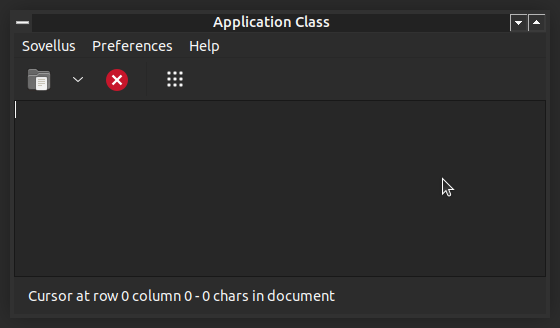

# Windows 3.x theme for Metacity/Marco

This is an Windows 3.x lookalike theme for Metacity and Marco window managers.

## Screenshot



## Installation

Notice that this not a full GNOME / MATE theme, only theme for the window
manager.

```bash
$ mkdir -p $HOME/.themes/Win3x
$ cd $HOME/.themes/Win3x
$ git clone https://github.com/RauliL/metacity-win3x-theme.git metacity-1
```

After this Win3x can be selected as window decorators through your desktop
environments UI customization settings.

## Close button

Even though original Windows 3.x didn't have one, this theme includes an
close button since window managers expect a theme to have one. In case you
want to disable it, you can use these commands:

### Metacity

```bash
$ dconf write /org/gnome/desktop/wm/preferences/button-layout "'menu:minimize,maximize'"
```

### Marco

```bash
$ dconf write /org/mate/marco/general/button-layout "'menu:minimize,maximize'"
```
